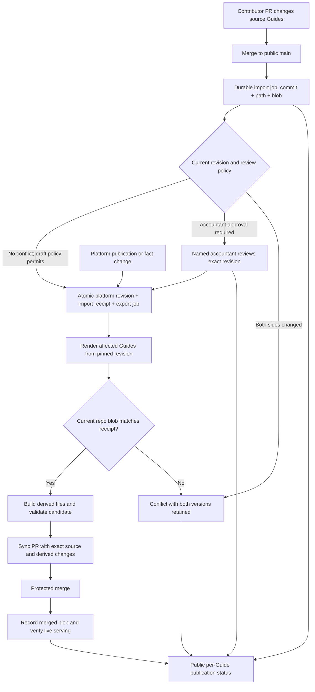

# Proposed sync flow: publish changes with receipts

Design proposal, 24 September 2026. **This is not deployed.** Current behaviour
and the existing integrity contract are documented in [WEBSITE-SYNC.md](WEBSITE-SYNC.md).

The aim is for a contributor to see whether their change is live, waiting for
the named accountant, or blocked by a specific conflict, without asking the
founder to inspect the private database. Ordinary changes should move within
minutes; nightly reconciliation should repair missed work, not be the main path.

## One publication system, two entry points

The platform owns the published revision. A merged repository contribution is
an input to that revision, not something the next database export may discard.
The source files and database may temporarily differ while a change awaits
review; the status must say so explicitly.

## Contributor experience

After a source PR merges, its publication check shows one row per Guide:

| Status | Meaning | Next owner |
|---|---|---|
| Queued | The exact commit and source file were durably recorded | Automation |
| Processing | Import/render/validation is running | Automation |
| Awaiting accountant review | A current byline requires approval of this revision | Named accountant, or an authorized maintainer under existing policy |
| Conflict | Both versions changed; neither was overwritten | Maintainer |
| Failed | A specific operation failed; the retry retains the original input | Automation first, maintainer if exhausted |
| Published | The intended platform revision is served and its repository projection is confirmed | Nobody |
| Superseded | A newer revision replaced this job | Newer job, linked explicitly |

An HTTP acknowledgement only means queued. A merged PR only means merged.
Neither is a publication receipt. The check should link to the source commit,
Guide, export commit and any newer job; expose no private records or credentials.
Use GitHub checks/status summaries rather than a comment or email for every retry.

Metadata-only changes must be ingested too. Compare the normalized supported
metadata and body, not body text alone. Normalize formatting deterministically
and make unsupported metadata explicit instead of silently claiming it was stored.

## Smallest durable data contract

These are proposed logical records, not existing table names. Extend existing
revision/proposal/ledger mechanisms where they fit; do not create a second
canonical fact store.

| Record | Essential data |
|---|---|
| Published Guide revision | Guide identity, increasing revision, immutable render input or snapshot hash, metadata, applicable review state |
| Per-path sync receipt | Repository, source path, last imported/exported Git blob SHA, related platform revision and merged commit |
| Import job | Unique repository + commit + path + blob; author for that path; status, attempts, error, expected platform revision |
| Export job | Guide + revision; rendered bytes/hash; expected repository blob; candidate/merged commit; status and attempts |

The database must save the new revision, invalidate old endorsements where
required, record the import receipt, and enqueue export **in one transaction**.
Workers perform external calls after commit. If a worker crashes, retry the same
job; do not reapply content under a new identity. Never deduplicate using a later
timestamp or an arbitrary prior successful ingest.

Canonical facts can be shared by several Guides. A fact change must identify
all affected bundles and slug aliases and enqueue their Guides. Local bundle
text, metadata, review/privacy changes and team rewrites can also alter a render.
A revision that watches only `skills.updated_at` is insufficient. A render must
use a consistent snapshot, not read half of one revision and half of the next.

## Rules that prevent lost contributions

1. Before export, compare the current source file's Git blob with the stored
   receipt. On a mismatch, allow only an exact-byte no-op repair; otherwise stop
   that Guide and show the conflict. Do not seed receipts by blindly trusting
   the current database or repository timestamp.
2. Compare the expected platform revision inside the import transaction. A
   stale import must not replace a newer platform revision. Preserve both
   inputs when review is necessary.
3. Advance receipts only after the relevant operation actually succeeds. An
   export requires confirmation of the merged file blob. A failed or partial
   batch must not advance unrelated Guides' receipts or attribution windows.
4. A new repository `main` invalidates an old publication candidate. Re-fetch,
   re-check and regenerate; do not automatically rebase an old render.
5. Deletions, renames and Guide retirement use an explicit policy and controlled
   migration. They are not ordinary edits and are never inferred from absence.
6. Attribution and concurrency are separate. Preserve the real contributor;
   retain an honest automation identity for system/team changes. Renaming the
   bot or assigning machine work to an accountant does not establish provenance.

The current public audit flags most existing source rewrites by the aggregate
sync bot, even legitimate team/automated changes. Adding a private CAS check
alone will **not** make that audit pass. Both repositories need an agreed,
tested publication contract: authenticated publisher, validated revision/blob
receipt, protected publication flow, and explicit handling of automated edits.
A commit-message assertion that “CAS passed” is not sufficient evidence.

## Fast execution without removing review

Use a database outbox (a job saved in the same transaction as the change) and
a retryable worker. Batch nearby changes briefly, render only affected Guides,
then rebuild dependent packages/indexes once per batch. Start with a proposed
five-minute objective for ordinary unreviewed changes; measure it before
promising it. Approval time is a separate metric.

Source PRs remain source-only. The publication automation may put validated
source and generated files together in its sync PR; the derived-tree guard must
recognize that narrowly authenticated workflow, not trust a branch prefix.
Where all mechanical gates pass and no professional review is required,
maintainers can authorize automatic merge for those sync PRs. Do not add a
founder approval to every routine export.

A narrowly scoped GitHub App can publish checks and sync PRs. Keep database
credentials private and never execute contributor code with privileged secrets.
Protected merging must revalidate the candidate against current `main` and
include schema/YAML checks, strict sync integrity and derived-file consistency.
Change branch rules only after the publisher can use that route.

Nightly reconciliation compares unfinished jobs, per-path receipts and actual
repository blobs. It retries missed work and reports real drift. It does not
re-render the complete catalogue just to discover three changes. Always
paginate, and retain a durable cursor so a seven-day lookback cannot lose a
long-standing failure.

## Migration and acceptance

1. **Contain the current defects.** Stop treating shallow-history boundaries
   and bot-committed exports as external edits. Require complete Git history;
   simply hiding root diffs can hide genuine edits too. Run public validation before
   publication; abort on rejected push or failed generators. Retain evidence
   of skipped Guides and do not interpret a green transport job as convergence.
2. **Add revision receipts in shadow mode.** Introduce additive tables/RLS and
   the transaction boundary. Inventory every render-affecting writer. Bootstrap
   only exact confirmed matches; quarantine differences for review. Prove the
   inbound transaction and retry behaviour without changing the publisher yet.
3. **Expose import outcomes.** Persist the exact input before acknowledging the
   webhook; report per-Guide status back to GitHub. Retain professional approval
   gates and surface their owner. Eliminate body-only and timestamp-only skips.
4. **Switch outbound to validated sync PRs.** Integrate strict per-path CAS,
   agree the automated-edit audit contract, adapt generated-file checks, then
   configure protected merging. Enable the change-driven worker after a shadow
   comparison. Keep the current path disabled once the new publisher takes over.
5. **Prove the round trip.** Platform v1 → source PR v2 → imported v2 → outbound
   normalized v2 must preserve every intended change and its attribution.

Release gates include duplicate/out-of-order notifications; metadata-only edits;
shared-fact fanout; a concurrent GitHub merge; a concurrent database revision;
accountant approval; hidden reviewer metadata; a team rewrite; generator failure;
and a crash after merge but before saving the receipt. Retrying the last case
must recognize the already-merged blob, not create a duplicate publication.

Measure median/p95 merge-to-live time, oldest queued revision, Guides waiting on
review/conflict, failed jobs, and confirmed convergence. The success condition
is that contributors can determine the next action themselves and routine
publication no longer waits on the founder.
